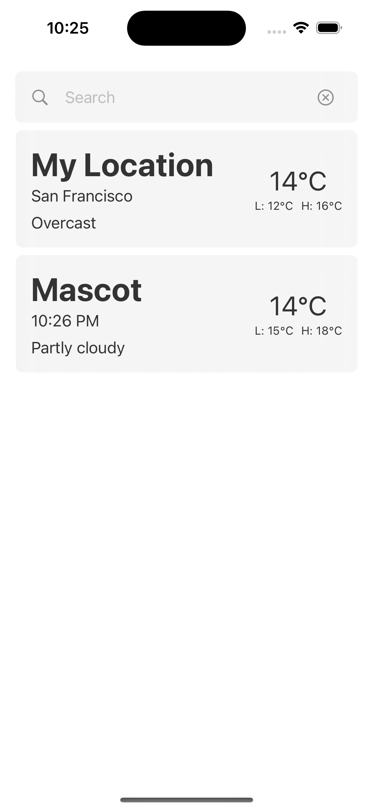
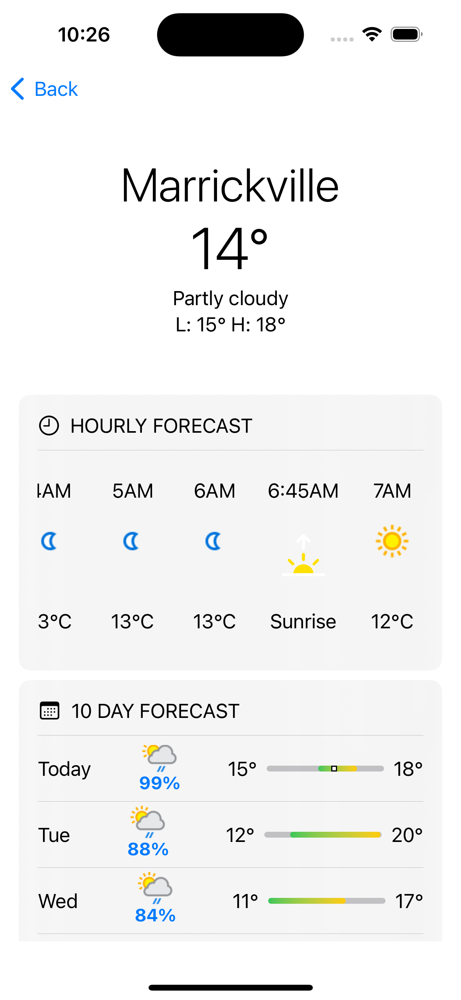
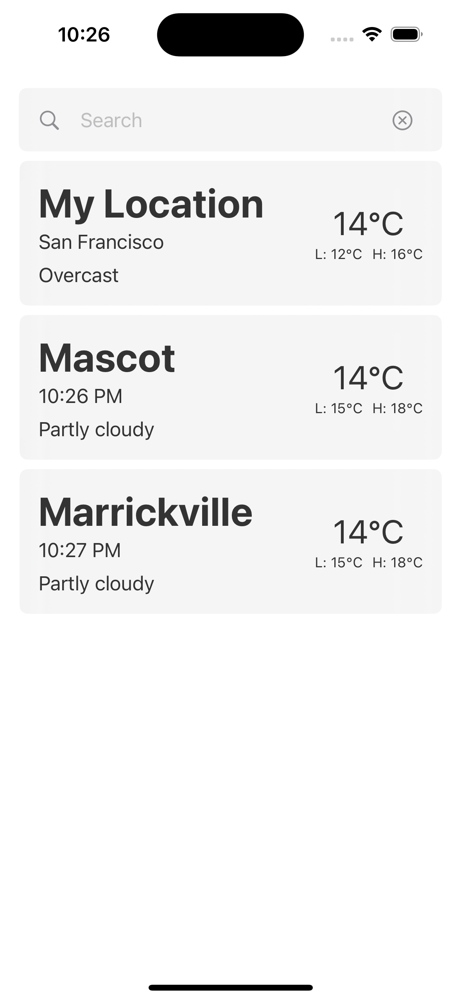

# 🌤️ WeatherApp – A Modern SwiftUI Weather App

**WeatherApp** is a sleek, modern weather application built with SwiftUI, designed to give users a fast, intuitive way to check current weather conditions. With support for saved locations, detailed forecasts, and location-based weather, it combines elegant design with robust functionality.

---

## ✨ Key Features

* **📍 Location-Based Weather** – Automatically fetch weather for your current location.
* **🔎 Search & Save** – Search for any location and save your favourites (up to 10).
* **📅 Hourly & Daily Forecasts** – View temperature trends, sunrise/sunset, and rain chance.
* **🧊 Modern UI** – Glassmorphism and SwiftUI animations for a contemporary experience.
* **♿ Accessibility First** – High contrast, readable text, and clear layout.

---

## 🧱 App Structure

> Built using a modular SwiftUI architecture for scalability and maintainability.

```
MainView
├── MainSearchBarView
│   ├── MainSearchBarFieldView
│   └── MainSearchBarItemView → ForecastView
└── MainListView
    └── MainListItemView
        └── ForecastListView
            ├── ForecastListLocationView
            └── ForecastListTemperaturesView

ForecastView
├── ForecastHeaderView
├── ForecastHourView
│   ├── ForecastHourItemView
│   └── SunIconView
└── ForecastDayView
    ├── ForecastDayItemView
    │   ├── WeatherIconView
    │   └── ForecastTemperatureBarView
```

Each view is paired with a dedicated `ViewModel` that handles logic, state, and API communication.

---

## 📱 Usage Overview

### 🚀 Getting Started

1. **Download and Launch** the WeatherApp on your iOS device.
2. **Grant Location Permission** (optional) – to automatically display local weather.
3. **View Dashboard** – Your location appears at the top as "My Location".

### 🔍 Searching & Viewing Locations

* Use the **Search Bar** to find a city.
* Tap a result to view a **detailed forecast** (hourly & 10-day).
* Tap **Add** in the forecast view to save it to the dashboard.

### 📌 Managing Saved Locations

* Saved locations appear on the main dashboard.
* Tap any saved location for quick forecast access.
* Up to **10 locations** can be saved (including your current location).

---

## ⚙️ Technologies Used

| Technology       | Description                                                      |
| ---------------- | ---------------------------------------------------------------- |
| **SwiftUI**      | Declarative UI framework for iOS                                 |
| **CoreLocation** | Location services for fetching user coordinates                  |
| **WeatherAPI**   | Weather data provider ([docs](https://www.weatherapi.com/docs/)) |

---

## 🧠 Architecture & Design Notes

* **MVVM Pattern**: All views use `@ObservedObject` or `@EnvironmentObject` view models for logic and state handling.
* **Asynchronous Data Fetching**: Weather data is fetched via async calls using `URLSession`.
* **Glassmorphism**: Used throughout the UI for a modern, clean design.
* **Reusable Components**: Views like `ForecastHourItemView` and `ForecastTemperatureBarView` are shared across screens for consistency.

---

## 🛠 Developer Notes

* Maximum saved locations: **10**
* Forecast data includes:

  * **Current conditions**
  * **Hourly** (including sunrise/sunset markers)
  * **10-day forecast** with min/max temperature bars

---

### Screenshots

| Main Dashboard | Searched Location | Location Saved |
|----------------|-------------------|----------------|
|  |  |  |


---
